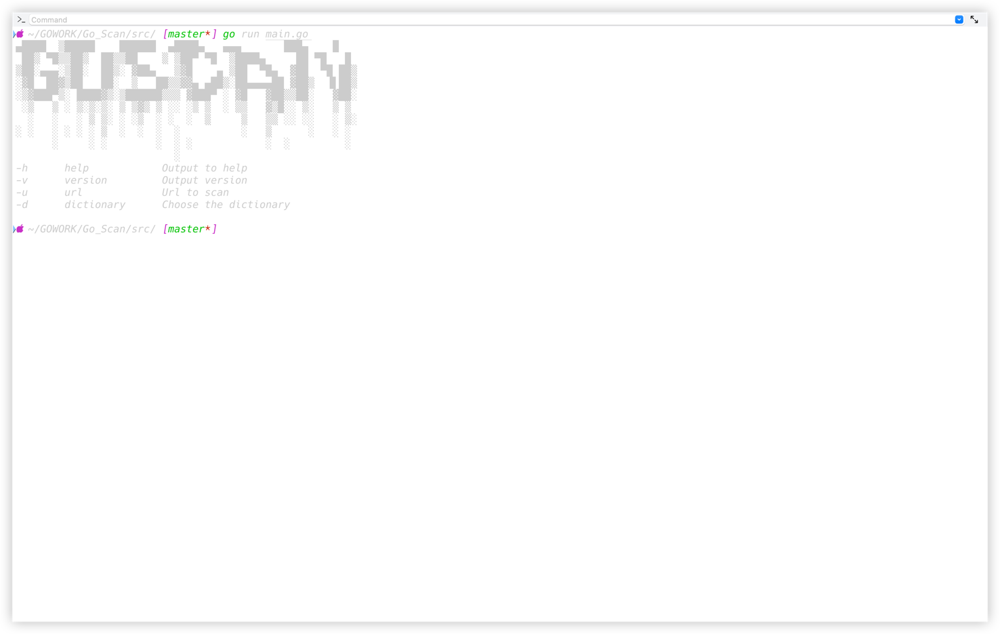
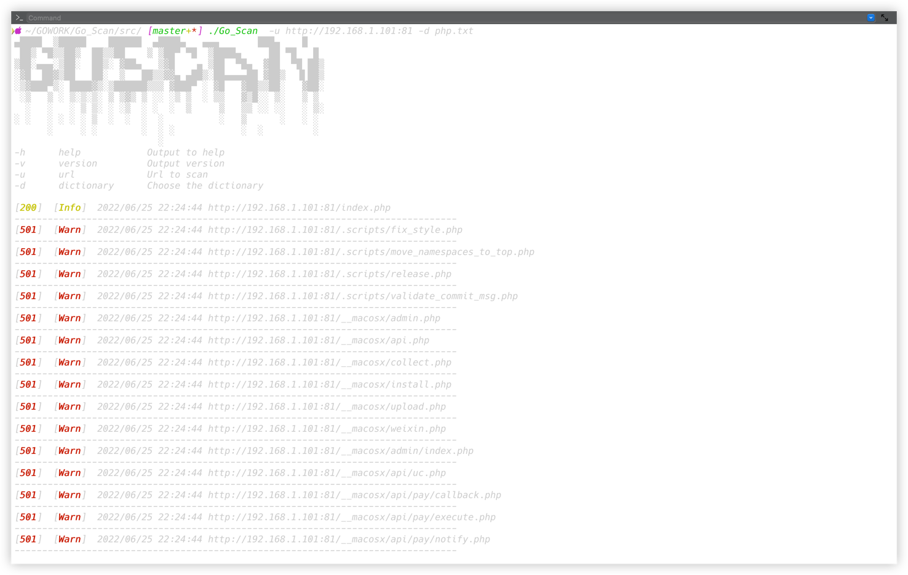

Go_Scan是一款轻量级web目录扫描工具，内置字典，如果需要添加字典可以将字典移动到dictionary目录中,
1.0.1版本实现了基本的web目录扫描
    
运行截图

使用参数

        "-h	help		Output to help"
	  "-v	version		Output version"
		"-u	url		Url to scan"
		"-d	dictionary	-d {dictionary name}"
		"			Choose the dictionary"
		"			This program provides you with dictionaries"
		"			{asp,aspx,backup,Comprehensive_risk,dir,fck,fingerprint,jsp,mdb,php,shell,top,type}"
		"			Format such as -d *.txt"
		"	If you want to use your dictionary,"
		"	put the dictionary in the dictionary folder"
		"	Add the name and suffix of your dictionary after it"

使用方式
    
    Go_Scan -u {url} -d {*.txt}

使用效果

扫描器会扫描项目目录下是否存在log文件夹，如果有将*.log保存到log文件夹下
如果没有，扫描器将创建log文件夹后保存*.log文件

[注] 需要您的电脑上有go环境go1.17.10及以上
linux/mac系统安装
    
    git clone https://github.com/Bravecoward1-oss/Go_Scan.git
    cd Go_Scan

您可以选择使用

    ./build
或

    cd src/ && make linux

会在src目录下生成Go_Scan程序

windows系统

    git clone https://github.com/Bravecoward1-oss/Go_Scan.git
    cd Go_Scan && make win

会在src目录下生成Go_Scan.exe程序

docker搭建
    
    git clone https://github.com/Bravecoward1-oss/Go_Scan.git
    cd Go_Scan && docker build -f dockerfile -t go_scan .
    docker run -d -p 666:666 -it --name Go_Scan go_scan:latest
    docker exec -it Go_Scan bash

cd 到src目录中可以直接使用编译好的Go_Scan

